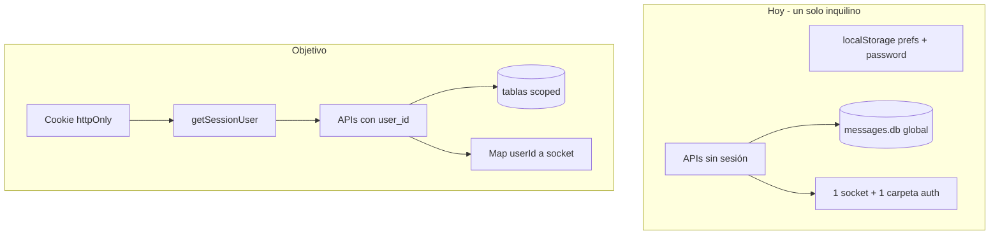

# Autenticación multi-usuario (plan v2)

Plan actualizado tras el cambio de **nombre de perfil → `username` único**, i18n, preferencias extra (zona, reloj, idioma, inicio de semana) y la UI de login/registro que aún no está cableada.

Hoy el panel es **un solo inquilino**: SQLite sin `user_id`, prefs y contraseña en `localStorage` (`wp-panel-prefs`), un socket Baileys, `auth_info_baileys/` y `whatsapp-status.json` globales. Cualquier petición a `/api/*` ve y muta todo.



## Invariante (no negociable)

Toda fila de negocio pertenece a **un** `users.id`. El cliente **nunca** manda `user_id`. Se toma solo de la cookie. Si una consulta, JOIN, wipe, cron o envío WhatsApp no filtra por ese id, es un bug de datos cruzados.

Identidades distintas, no mezclar:

| Concepto | Qué es | Qué no es |
| --- | --- | --- |
| `users.username` | Handle único del panel (`normalizeUsername`: minúsculas, `a-z0-9._`) | Nombre de WhatsApp |
| `users.email` | Correo único | Login obligatorio exclusivo (ver abajo) |
| `scheduled_messages.whatsapp_name` / `whatsapp_phone` | Cuenta Baileys que **envió** el mensaje | Usuario del panel |
| `contacts.name` | Etiqueta del destinatario | Perfil de WATime |

## 1. Modelo de datos

### `users`

- `id INTEGER PRIMARY KEY`
- `username TEXT NOT NULL UNIQUE` — normalizado con la misma función que hoy (`lib/preferences.js` `normalizeUsername`). Longitud mínima 3, máxima ~32.
- `email TEXT NOT NULL UNIQUE` — minúsculas, trimmed.
- `password_hash TEXT NOT NULL` — `scrypt` (Node `crypto`). Nunca texto plano. Quitar `prefs.password`.
- Preferencias **en la fila**, no en localStorage como fuente de verdad: `theme`, `agenda_view`, `week_starts_on`, `timezone`, `hour_clock`, `language`, `logo_data_url`.
- `created_at`
- **No** hay columna `name`. El plan v1 la tenía; el producto ya no.
- **No** hay `role` privilegiado hasta que exista un modelo de admin real. El “Administrador” del mock no se copia a la DB como permiso.

Username: único a nivel global (no por tenant). Tras el alta, **no editable** en v1 (evita hijack visual y enlaces rotos). El correo sí se puede cambiar con UNIQUE.

### Tablas de negocio

Añadir `user_id INTEGER NOT NULL REFERENCES users(id)` a:

- `scheduled_messages`
- `contacts`
- `templates`

Índices (los UNIQUE actuales son **globales** y son un vector de choque entre cuentas):

- Quitar UNIQUE de `contacts.identifier` y `contacts.search_key`.
- `UNIQUE (user_id, identifier)` y `UNIQUE (user_id, search_key)`.
- Índices de listado: `(user_id, scheduled_for)`, `(user_id, status)`, `(user_id, updated_at)`.

### JOIN de agenda (fuga clásica)

Hoy:

```sql
LEFT JOIN contacts c ON c.identifier = m.recipient
```

Dos usuarios pueden tener el mismo JID con **nombres distintos**. Sin `user_id` el JOIN pega el contacto de otro.

Correcto:

```sql
LEFT JOIN contacts c
  ON c.user_id = m.user_id AND c.identifier = m.recipient
```

Toda SELECT/UPDATE/DELETE de una fila por `id` incluye `AND user_id = ?`. Un id numérico de otra cuenta → 404, no 200.

### Uploads

Hoy `public/uploads/{timestamp-rand}` es global; wipe `?all=1` borra **todas** las imágenes.

- Guardar en `public/uploads/{userId}/…`
- `deleteMessageImage` solo si el path empieza por `uploads/{userId}/`
- Wipe solo las filas (e imágenes) de la sesión
- URLs siguen siendo estáticas (quien adivine el path puede leer el archivo). Mitigación v1: nombre impredecible + no listar directorios. Aislar detrás de API queda fuera de v1.

## 2. Migración de datos existentes (una sola vez)

Tabla `app_meta` (`key`, `value`) o fila `legacy_migrated_user_id`.

Al **primer** `POST /api/auth/register` exitoso, en la **misma transacción**:

1. Insertar el usuario (username + email del form, hash de contraseña, prefs por defecto o las de `localStorage` **solo en ese cliente**, no mezclar prefs de otro navegador en el servidor).
2. Si `legacy_migrated_user_id` está vacío: `UPDATE scheduled_messages/contacts/templates SET user_id = ?` en filas huérfanas; mover `auth_info_baileys/` → `auth_info_baileys/user-{id}/` si existe; mover `whatsapp-status.json` a `whatsapp-status/user-{id}.json` o eliminarlo (el archivo global **no** debe seguir leyéndose).
3. Guardar `legacy_migrated_user_id`.

Registros siguientes: datasets vacíos, carpeta auth vacía. **Nunca** reasignar filas ya migradas.

Si alguien registra antes de que exista la columna NOT NULL: migrar en dos pasos (columna nullable → backfill → NOT NULL). No dejar `user_id` NULL en producción.

No crear un usuario `admin` automático desde el mock. El primer registro es el dueño de los datos actuales.

## 3. Sesión y auth HTTP

- Cookie httpOnly, `SameSite=Lax`, `Secure` en producción, HMAC o `jose`, payload `{ userId, exp }`. Caducidad ~7 días. Nombre p. ej. `wp_session`.
- `lib/auth.js`: `hashPassword` / `verifyPassword`, `createSession`, `clearSession`, `getSessionUser(request)` → `401` si falta.
- Login: aceptar **username o email** en un solo campo (ambos UNIQUE). Register: username + email + password + confirm (como `AuthScreen` ahora, sin campo nombre).
- Rutas: `POST /api/auth/register`, `POST /api/auth/login`, `POST /api/auth/logout`, `GET /api/auth/me`, `POST /api/auth/password`.
- Username en register: `normalizeUsername`; rechazar vacío, colisión 409, caracteres inválidos 400.
- `proxy.js`: sin cookie → `/login`. Excepciones: `/login`, `/registro`, estáticos, `/api/auth/*`. **Todas** las demás APIs (schedule, contacts, templates, whatsapp, preferences, cron) exigen sesión. No crear `middleware.js` a la vez (Next 16).

Cablear `AuthScreen` (hoy solo `preventDefault`). Logout en `UserMenu` y Configuración llama a `/api/auth/logout` y limpia cache local.

## 4. Preferencias: dejar de ser un segundo usuario

Hoy `wp-panel-prefs` guarda `username`, `email` y `password` en el navegador. En el mismo Chrome, el usuario B heredaría el perfil A.

Reglas:

- Fuente de verdad: `GET/PUT /api/preferences` (o campos en `GET /api/auth/me` + PATCH). PUT **no** cambia `username` ni `password`.
- Cache opcional solo de `theme` + `language` para el script de `layout.js`, clave `wp-panel-ui` **sin** identidad. Al login, sobrescribir con las prefs del servidor. Al logout, borrar cache (el theme boot cae a default).
- `resetLocalData` de privacidad: wipe **solo** filas del `user_id` (mensajes, contactos, plantillas, uploads, carpeta Baileys de ese usuario). No borrar `users`. No tocar datos de otros.

## 5. WhatsApp y scheduler (el cruce más grave)

Hoy:

- Un `globalThis.__whatsappClient`.
- Status lee `auth_info_baileys/creds.json` y `whatsapp-status.json` **sin usuario**.
- El timer hace `SELECT * FROM scheduled_messages WHERE status = 'pending'` y envía **todo** por el único sock.
- `lib/scheduler.js` + `GET /api/cron` marcan pending → `sent` **sin WhatsApp** y sin dueño.
- `bot.js` usa la misma DB y la misma carpeta auth: segundo proceso que enviaría la cola global.

Objetivo:

- `Map<userId, state>` (sock, QR, connecting, generation, timer).
- Auth: `auth_info_baileys/user-{id}/`. Logout WhatsApp borra **solo** esa carpeta.
- Status/connect/logout: siempre `getSessionUser`; devolver solo el estado de ese id. Nunca un QR ajeno.
- Un timer **por** usuario conectado, o un timer global que itera el Map:

```sql
SELECT * FROM scheduled_messages
WHERE user_id = ? AND status = 'pending'
```

Enviar solo con el sock de ese `user_id`. Si no hay sock conectado, el mensaje sigue `pending`. **Prohibido** enviar el mensaje de A con el sock de B.

- `whatsapp_phone` / `whatsapp_name`: rellenar **al enviar** desde `accountFromSock` de ese sock (el INSERT puede dejarlos vacíos). Así el historial no hereda la sesión global del momento del alta.
- Desactivar o eliminar el envío simulado de `lib/scheduler.js`. Cron: o se quita, o exige secreto + llama al mismo `sendScheduledMessage` scoped. `bot.js`: documentar como **incompatible** con multi-usuario; no ejecutarlo en paralelo con Next.

`hasSession` y reconexión: por carpeta `user-{id}`, no por un `creds.json` raíz.

## 6. APIs a tocar (checklist de scope)

| Superficie | Riesgo hoy | Cambio |
| --- | --- | --- |
| `GET/POST/DELETE /api/schedule` | Lista/crea/borra todo; `?all=1` wipe global | `WHERE user_id`; INSERT con `user_id`; wipe scoped; JOIN scoped |
| `GET/POST/DELETE /api/contacts` | CSV y UNIQUE globales | Filtro + UNIQUE compuestos |
| `GET/POST/PUT/DELETE /api/templates` | idor por `id` | `id AND user_id` |
| `/api/whatsapp/*` | QR y número de cualquiera | Map por sesión |
| `/api/cron` | Marca sent a toda la cola | Quitar o secret + send real scoped |
| Nuevo `/api/preferences` | — | Solo fila `users` de la sesión |
| `PreferencesPanel` wipe | Llama `?all=1` | Sigue igual de forma, backend scoped |

Helper único, p. ej. `requireUserId(request)`, usado en **todas** las rutas de negocio. Tests mentales: usuario A no ve ids de B; 404 al borrar id ajeno; contacto duplicado permitido entre A y B, no dentro de A.

## 7. UI ya existente (no rehacer de cero)

- `AuthScreen`, `/login`, `/registro`: conectar APIs; campo **Usuario** (ya no nombre).
- `UserMenu` / Configuración: iniciales y título desde `username` de `/api/auth/me`.
- `PreferencesPanel` perfil: username **solo lectura**; email editable; password vía `/api/auth/password`.
- i18n: errores de auth (`usuario ocupado`, `correo ocupado`) en `lib/i18n/messages.js` + `code` en JSON.

## 8. Fuera de v1

- OAuth, magic link, 2FA.
- Varias sesiones de panel del mismo user (más allá de una cookie).
- Servir uploads solo autenticados.
- Roles admin / equipos / compartir contactos.
- Username renombrable.
- Ejecutar `bot.js` junto al dashboard.

## Orden de implementación

1. **Schema + migración atómica** (users, `user_id`, índices compuestos, meta de legado). Sin esto no hay auth.
2. **Auth API + cookie + `proxy.js` + cablear login/registro/logout.** Hasta aquí las APIs de negocio aún no son seguras: no abrir registro público en producción antes del paso 3.
3. **Scope de schedule / contacts / templates / preferences** (JOINs, IDOR, wipes, uploads path). Verificar con dos cuentas en el mismo `messages.db`.
4. **WhatsApp Map + carpetas por user + scheduler scoped.** Apagar cron simulado y `bot.js`.
5. **Quitar identidad y password de localStorage**; cache solo theme/lang; cambio de contraseña real.

## Criterio de aceptación (datos cruzados)

Con dos usuarios registrados en la misma instancia:

- A no lista, edita ni borra mensajes/contactos/plantillas de B.
- El mismo identificador de canal puede existir en A y en B con nombres distintos; el calendario de A muestra el nombre de A.
- El QR y el número de WhatsApp de A no aparecen en el menú de B.
- Un mensaje pending de A no se envía cuando solo B tiene WhatsApp conectado.
- Wipe de historial/contactos de A no toca filas ni `uploads/{b}/`.
- Logout de A no cierra la sesión Baileys de B (procesos/mapas distintos).
- Tras logout, el siguiente login no rellena username/email/password del usuario anterior desde `localStorage`.
